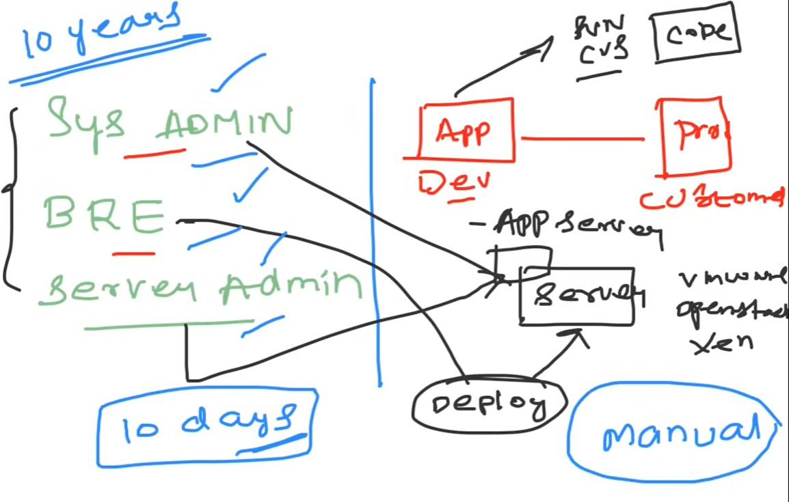

# What is DevOps

## Definition
DevOps is more of a **culture** than a tool (concept established ~10 years ago).
It is the process of improving application delivery within an organisation via:
- Automation
- Quality
- Continuous monitoring (Observability)
- Continuous testing
These can include usage of tools as well (advanced). Eg: K8s, AWS etc.

---

## Why DevOps?

**Before DevOps**, delivering an app from the developer's side to the customer required
a lot of other roles and intermediate processes:
1. **Roles involved:** System Admin, Build & Release Engineer (BRE), Server Admin
2. **Processes involved:** Server creation, deploying app on server, app server creation
3. All of this was **manual effort** and required a lot of time. **To solve this → DevOps**

**Example:** PUBG introducing a new feature used to take 10 days.
With DevOps → reduced to 1–2 days, sometimes within hours.

---

## Key Insight
DevOps is not only about delivery speed — it's about **improving the entire delivery
process** (quality, reliability, monitoring). CI/CD is just one part of it.

---

